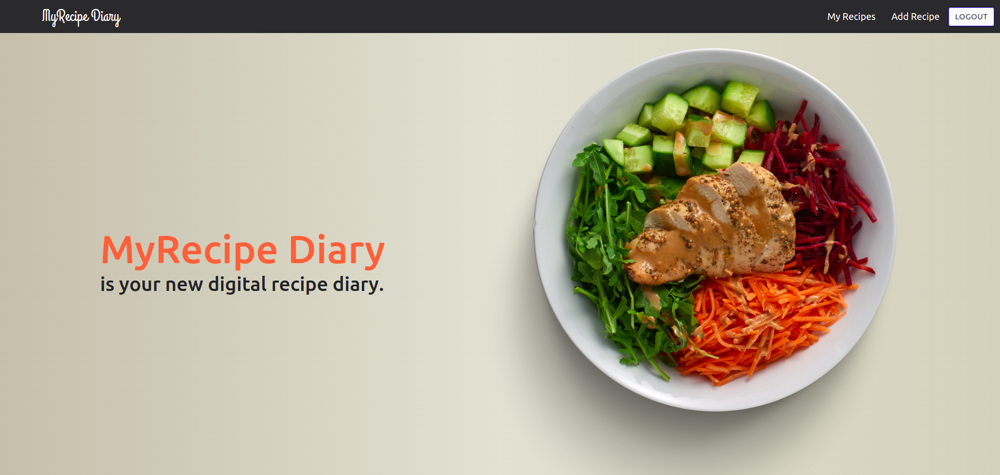
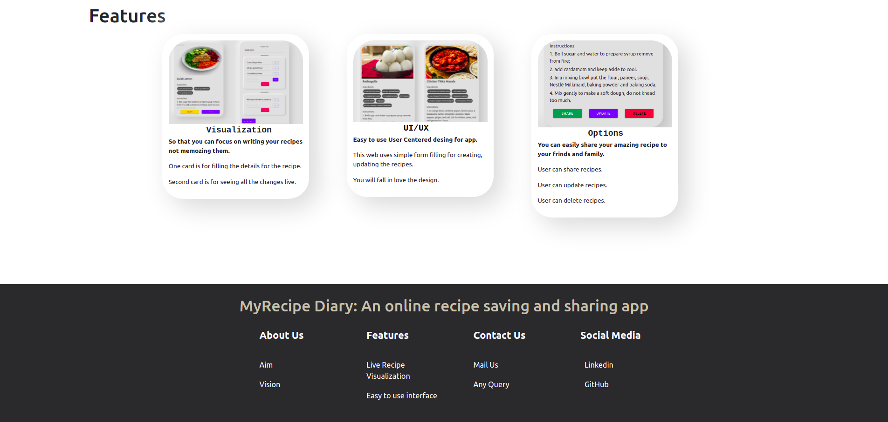
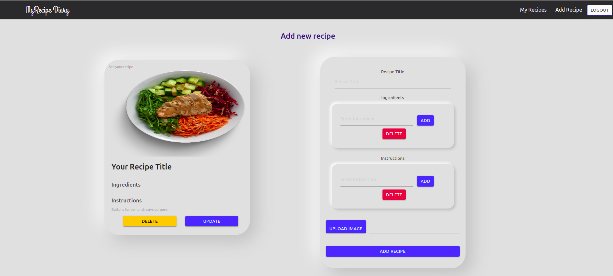
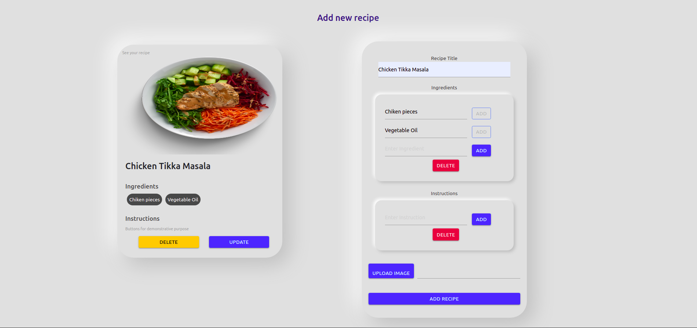
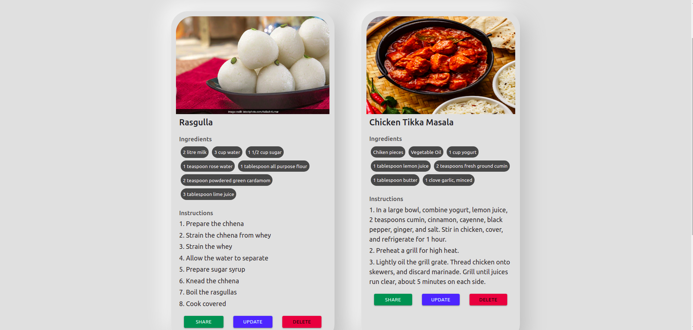
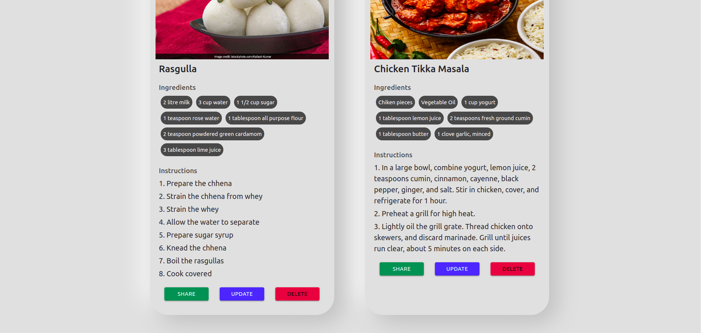
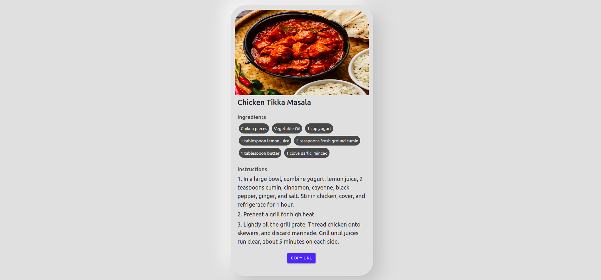

# MyRecipe Diary App
MyRecipe Diary App allows user to create, update, share and delete recipes. It is an easy to use minimalistic recipe creating app providing wonderful user experience.
<br>
- Link to App :-
https://recipechallengeapp.herokuapp.com/

## You will fall in love with creating recipes 😍
<b>- What did I learn? </b>
<br>
I polished my full stack skills, learned about UX/UI and implementing them. I also get to know about basic state management, REST APIs, fetching APIs, Authenticating using JWT.

## Features
- Users can <b>Create</b> Recipe
- Users can <b>Update</b> Recipe
- Users can <b>Delete</b> Recipe
- Users can <b>Share</b> Recipe
- User can <b>See the changes in Recipe while Creating</b>

## Tech Stack Used
- Frontend- HTML, CSS, Bootstrap, Flexbox, Javascript
- Backend- Node.js, Express.js 
- Frameworks/Library- React.js, Sendgrid, Bycrypt, JWT, Mongoose, Material-Ui, React-Moment 
- Database- MongoDB Atlas
- Dev Softwares/Tools- VS Code, Postman, Git, GitHub, Canva
- Hosting Platform- Heroku

## Installation
Install dependencies
- Clone the repo -> ````git clone https://github.com/vaibhavpathak999/RecipeApp.git ````
- Enter to the folder -> ````cd RecipeApp ````
- Open in VS Code ->  ````code .````
- Go to backend -> ````cd backend````
- Install all dependencies -> ````npm install````
- Do Same for recipe_app frontend
- In backend folder add .env file -> ````touch .env````
- Add all secret keys in your environment file
- Inside main directory run app -> ````node app.js````
- Inside recipe_app (client folder) run app -> ````npm start````

## Badges


## Gallery
- ### Home page
<p align="center"></p><br>

- ### Features
<p align="center"></p><br>

- ### Add Recipe Card
<p align="center"></p><br>

- ### Live changes in Recipe Card
<p align="center"></p><br>

- ### My recipes page
<p align="center"></p><br>

- ### Features page
<p align="center"></p><br>

- ### Shared Recipe Page
<p align="center"></p><br>
